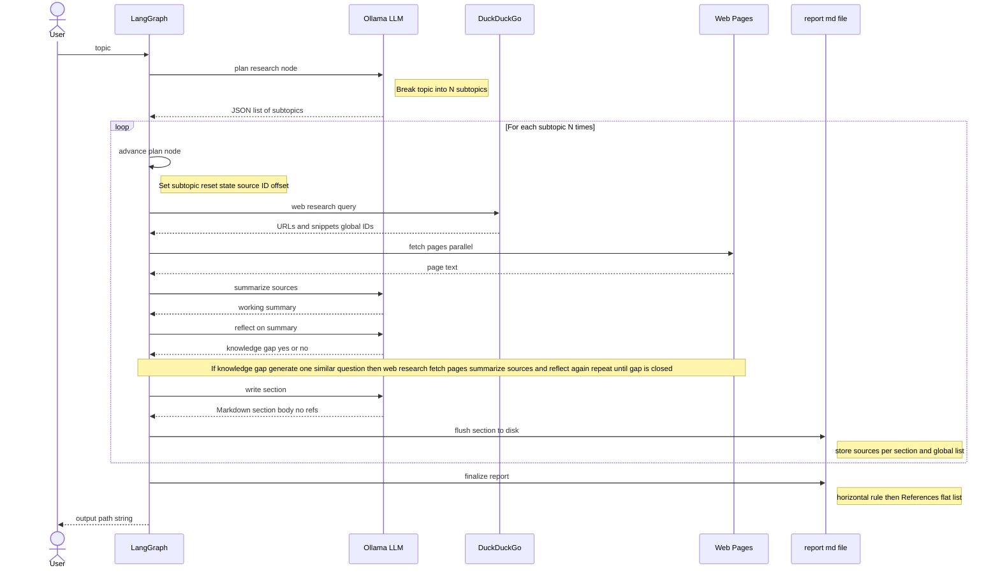

# DEEP RESEARCH

**ローカルでディープリサーチを、コマンド一つで。** 調査したいテーマを渡すと、この CLI が計画を立て、Web を検索し、実ページを読み、得た内容をどこでも開ける **読みやすい Markdown レポート**にまとめます。処理はすべて手元のマシン上で完結します。推論は **Ollama**、ワークフローは **LangGraph**、検索は **DuckDuckGo**（`ddgs`）、記事本文の取得は **httpx** と **trafilatura** が担当します。

---

## アーキテクチャ

内部の流れはシンプルです。まずテーマが **5〜8 個のサブトピック**に分かれます（`create_subtopics`）。サブトピックごとに Web 検索を回し、モデルがまだ足りないと判断したら、**一段シャープなフォローアップクエリを 1 本**立てて再検索し、満足するまで繰り返します。各サブトピックの節ができあがるたびに **その時点でディスクへ書き出し**（`write_section`）してから次へ進むため、ノート PC でも文脈を抑えつつ、最後に **長い `.md` ファイル**と末尾の引用一覧が手に入ります。



### LangGraph のノードとエッジ

実行用のグラフは `src/deep_research/graph.py` で組み立て、状態の型は `src/deep_research/state.py` の `SummaryState` です。各 **ノード** は Python の関数で、現在の状態を読み、更新分だけを辞書として返します。**エッジ**でノードを直列につなぎ、**条件付きエッジ**が「追加で調べるループ」と「次のサブトピックへ進むループ」を実現しています。

| ノード                                   | 役割                                                                                                                                                                                                               |
| ---------------------------------------- | ------------------------------------------------------------------------------------------------------------------------------------------------------------------------------------------------------------------ |
| `create_subtopics`                       | LLM を一度呼び、ユーザーのテーマを `research_plans`（サブトピックのリスト）に分割する。出力ファイルのパスや蓄積用フィールドもここで初期化する。                                                                    |
| `load_next_subtopic`                     | いま扱うサブトピックを `topic` にセットし、計画単位のフィールド（`sources`、`working_summary`、`need_more_research`、`loop_count` など）をリセットする。引用番号が全体で連なるよう `source_id_offset` も設定する。 |
| `search_web`                             | `search_queries` があればそれで、なければ現在のサブトピック文字列で DuckDuckGo を検索し、ヒットを関連度フィルタ付きで `sources` にマージする。                                                                     |
| `fetch_page_content`                     | 最大設定件数まで HTML を取得し、各ソース行に抜粋テキストを付ける（任意の処理）。                                                                                                                                   |
| `summarize_sources`                      | スニペットと取得済み抜粋から、LLM が現在のサブトピック向けの **作業用要約**（`working_summary`）をまとめる。                                                                                                       |
| `evaluate_coverage`                      | LLM が JSON で返す。**知識ギャップがあるか**（`need_more_research`）、短い理由（`reflection_text`）、更新後の `loop_count`（`--max-loops` および設定の `max_loops` で上限）。                                      |
| `generate_similar_question_if_necessary` | ルーティングでここに来たとき、LLM がフォローアップ用の `search_queries` を埋め、そのあと再び `search_web` へ進む。                                                                                                 |
| `write_section`                          | LLM が節本文だけの Markdown を書き、ノード側でレポートファイルに追記する。`section_sources` と `all_sources` を更新し、`current_plan_index` を進める。                                                             |
| `finalize_report`                        | ファイル末尾に、まとめて **参考文献**ブロックを追記する。                                                                                                                                                          |

**固定エッジ:** `START` → `create_subtopics` → `load_next_subtopic` → `search_web` → `fetch_page_content` → `summarize_sources` → `evaluate_coverage`。ほかに `generate_similar_question_if_necessary` → `search_web`、`finalize_report` → `END`。

**条件付きエッジ:** `evaluate_coverage` のあと、`need_more_research` が真で、かつ `loop_count` が `max_loops` に達していなければ `generate_similar_question_if_necessary`、それ以外は `write_section`。`write_section` のあと、`research_plans` にまだサブトピックが残っていれば `load_next_subtopic`、なければ `finalize_report`。

---

### フラグ

| フラグ              | 説明                                                                                                                              |
| ------------------- | --------------------------------------------------------------------------------------------------------------------------------- |
| `--model`           | 使う Ollama モデル名（`OLLAMA_MODEL` より優先）                                                                                   |
| `--max-loops`       | サブトピックごとのリフレクション（追加調査）ループの上限（既定 3）                                                                |
| `--max-results`     | クエリあたりの DuckDuckGo 結果数（既定 5）                                                                                        |
| `--search-workers`  | 1 ラウンドあたりの並列 DDG クエリ数（既定 4、最大 16。`1` で逐次。環境変数 `DEEP_RESEARCH_SEARCH_WORKERS` でも指定可）            |
| `--lang`            | `ja`（既定）または `en` — プロンプトとレポートの言語（`DEEP_RESEARCH_LANG` でも指定可）                                           |
| `--max-plans`       | 生成するサブトピック数（5〜8、既定 6。`DEEP_RESEARCH_MAX_PLANS` でも指定可）                                                      |
| `--fetch-pages [N]` | ラウンドあたりのフルページ取得数（既定 8。`DEEP_RESEARCH_FETCH_PAGES`）。`N` を付けて上書き。`--fetch-pages` 単体は既定値を使う。 |
| `--fetch-workers`   | 並列 HTTP 取得数（既定 4、最大 16。`1` で逐次。`DEEP_RESEARCH_FETCH_WORKERS`）                                                    |
| `--no-fetch-pages`  | フルページ取得をオフにし、スニペットのみで動かす                                                                                  |

---

## 出力ファイルの構造

```markdown
# 調査テーマ

## サブトピック 1

（本文とインライン引用 [1][2]…）

## サブトピック 2

（本文とインライン引用 [3][4]…）

## 参考文献

1. タイトル A — URL
   _スニペット_
2. タイトル B — URL
   _スニペット_
3. タイトル C — URL
   …
```

- 各セクションの本文は、そのサブトピックの調査ループが終わるたび **すぐにディスクへ書き込まれる**。
- ソース引用の番号（`[n]`）は、すべてのサブトピックを通して **ひと続きの連番**になる。
- 参考文献は最後に `finalize_report` で **一度だけ** まとめて追記されるので、実行が途中で止まっても、それまでの本文は読める。

---

## セットアップ

### 1. Ollama のインストールとモデルの取得

[Ollama をインストール](https://ollama.com/)し、モデルを pull します（推論向きの例）:

```bash
ollama pull deepseek-r1:8b
```

### 2. Python 環境（Python 3.11 以上）

```bash
cd /path/to/deep-research
python3 -m venv .venv
source .venv/bin/activate
pip install -e .
```

### 3. `.env`（任意）

```env
OLLAMA_BASE_URL=http://127.0.0.1:11434
OLLAMA_MODEL=deepseek-r1:8b
DEEP_RESEARCH_MAX_LOOPS=3
DEEP_RESEARCH_MAX_RESULTS=5
DEEP_RESEARCH_LANG=ja
DEEP_RESEARCH_MAX_PLANS=6
DEEP_RESEARCH_FETCH_PAGES=8
DEEP_RESEARCH_SEARCH_WORKERS=4
DEEP_RESEARCH_FETCH_WORKERS=4
```

## 使い方

```bash
python -m deep_research "調査したいテーマ"
```

## レポートはカレントディレクトリに `report_<テーマ>.md` として書き出されます（ファイル名はテーマ文字列から決まります）。

## トラブルシューティング

- **`Connection refused`（Ollama）**: `ollama serve` を動かし、既定以外のホスト・ポートなら `.env` の `OLLAMA_BASE_URL` を合わせる。
- **JSON のパースエラー**: より小さなモデル（例: `llama3.2`）を試すか、`nodes.py` の `temperature` を下げる。
- **DuckDuckGo のレート制限**: `--max-results` を減らす、`--search-workers 1` にする、少し待つ。
- **取得エラーや本文が空になる**: Bot 対策や JavaScript 必須のサイトが多いときは `--no-fetch-pages`。HTTP 429 が続くときは `--fetch-workers 1` を試す。
