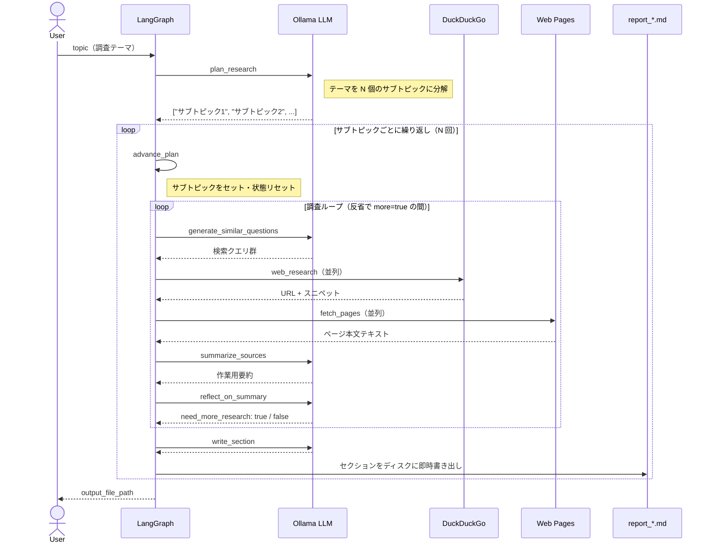

# deep_research

> [English README](README_EN.md)

ローカル動作の **ディープリサーチ CLI**。**LangGraph** でグラフを構成し、**Ollama** を LLM として使用、**DuckDuckGo**（`ddgs`）で検索、**httpx + trafilatura** でページ本文を取得。

トピックをまず **N 個のサブトピックに分解**し（`plan_research`）、サブトピックごとに「検索 → フェッチ → 要約 → 反省」のループを繰り返し、十分な情報が集まった時点でそのサブトピックの節を **Markdown ファイルに即時書き出し**（`write_section`）してから次のサブトピックに進みます。ローカルの文脈ウィンドウを節約しながら **長文レポート**を生成できます。

---

## グラフの流れ



---

## セットアップ

### 1. Ollama のインストールとモデルの取得

[Ollama をインストール](https://ollama.com/)し、モデルを pull します（推論特化モデルの例）:

```bash
ollama pull deepseek-r1:8b
```

### 2. Python 環境の構築（Python 3.11 以上）

```bash
cd /path/to/deep-research
python3 -m venv .venv
source .venv/bin/activate
pip install -e .
```

### 3. `.env` の作成（任意）

```env
OLLAMA_BASE_URL=http://127.0.0.1:11434
OLLAMA_MODEL=deepseek-r1:8b
DEEP_RESEARCH_MAX_LOOPS=3
DEEP_RESEARCH_MAX_RESULTS=5
DEEP_RESEARCH_LANG=ja
DEEP_RESEARCH_MAX_PLANS=6
DEEP_RESEARCH_FETCH_PAGES=8
DEEP_RESEARCH_SEARCH_WORKERS=4
DEEP_RESEARCH_FETCH_WORKERS=4
```

---

## 実行

```bash
python -m deep_research "調査したいテーマ" --out report.md
```

またはコンソールスクリプトで:

```bash
deep-research "調査したいテーマ" -o report.md
```

### オプション一覧

| フラグ                  | 説明                                                                                                      |
| ----------------------- | --------------------------------------------------------------------------------------------------------- |
| `--out` / `-o`          | 出力 Markdown ファイルのパス（省略時は `report_<テーマ>.md` として自動生成）                              |
| `--model`               | Ollama モデル名（`OLLAMA_MODEL` を上書き）                                                                |
| `--base-url`            | Ollama サーバー URL（`OLLAMA_BASE_URL` を上書き）                                                         |
| `--max-loops`           | サブトピックごとの反省ループ上限（デフォルト 3）                                                          |
| `--max-results`         | クエリあたりの DuckDuckGo 結果件数（デフォルト 5）                                                        |
| `--search-workers`      | 並列 DDG 検索数（デフォルト 4、最大 16；`1` = 逐次；`DEEP_RESEARCH_SEARCH_WORKERS`）                      |
| `--lang`                | `ja`（デフォルト）または `en` — プロンプト言語（`DEEP_RESEARCH_LANG`）                                    |
| `--max-plans`           | 生成するサブトピック数の上限（3〜8、デフォルト 6；`DEEP_RESEARCH_MAX_PLANS`）                             |
| `--fetch-pages [N]`     | ラウンドごとのフルページ取得数（デフォルト 8；`DEEP_RESEARCH_FETCH_PAGES`）。`--fetch-pages` のみで既定値 |
| `--fetch-workers`       | 並列 HTTP フェッチ数（デフォルト 4、最大 16；`1` = 逐次；`DEEP_RESEARCH_FETCH_WORKERS`）                  |
| `--no-fetch-pages`      | フルページ取得を無効化（スニペットのみで動作）                                                            |

---

## 出力ファイルの構造

```markdown
# 調査テーマ

## サブトピック 1
（調査結果の本文・引用 [1][2]…）

### 参考文献
1. タイトル — URL
   _スニペット_

## サブトピック 2
…
```

各サブトピックの節は研究が完了した時点でファイルに**即時書き込み**されます。次のサブトピックに移る前に前の節の情報はメモリから解放されます。

---

## トラブルシューティング

- **`Connection refused` (Ollama)**: `ollama serve` を起動し `--base-url` を確認してください。
- **JSON パースエラー**: 小さいモデル（例: `llama3.2`）を試すか、`nodes.py` の `temperature` を下げてください。
- **DuckDuckGo レート制限**: `--max-results` を減らす、`--search-workers 1` で逐次実行、またはしばらく待ってください。
- **ページ取得エラー**: Bot ブロックや JavaScript 必須のサイトが多い場合は `--no-fetch-pages` を使用してください。HTTP 429 が多発する場合は `--fetch-workers 1` を試してください。
