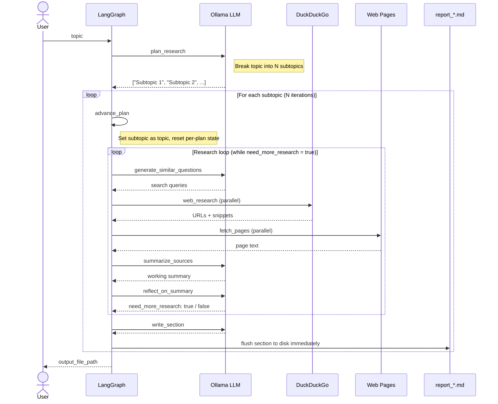

# deep_research

> [日本語 README（デフォルト）](README.md)

A local **deep research CLI** powered by **LangGraph**, **Ollama**, **DuckDuckGo** (`ddgs`), and full-page fetch (**httpx + trafilatura**).

The topic is first **broken into N subtopics** (`plan_research`). For each subtopic, a research loop of search → fetch → summarize → reflect runs until the model is satisfied, then that subtopic's section is **immediately written to disk** (`write_section`) before moving to the next. This keeps local context window usage bounded while producing a **long-form Markdown report**.

---

## Graph flow



---

## Setup

### 1. Install Ollama and pull a model

[Install Ollama](https://ollama.com/), then pull a model (reasoning-oriented example):

```bash
ollama pull deepseek-r1:8b
```

### 2. Python environment (Python 3.11+)

```bash
cd /path/to/deep-research
python3 -m venv .venv
source .venv/bin/activate
pip install -e .
```

### 3. Optional `.env`

```env
OLLAMA_BASE_URL=http://127.0.0.1:11434
OLLAMA_MODEL=deepseek-r1:8b
DEEP_RESEARCH_MAX_LOOPS=3
DEEP_RESEARCH_MAX_RESULTS=5
DEEP_RESEARCH_LANG=en
DEEP_RESEARCH_MAX_PLANS=6
DEEP_RESEARCH_FETCH_PAGES=8
DEEP_RESEARCH_SEARCH_WORKERS=4
DEEP_RESEARCH_FETCH_WORKERS=4
```

---

## Usage

```bash
python -m deep_research "Your research question" --out report.md
```

Or use the console script:

```bash
deep-research "Your research question" -o report.md
```

### Flags

| Flag                  | Description                                                                                                                       |
| --------------------- | --------------------------------------------------------------------------------------------------------------------------------- |
| `--out` / `-o`        | Output Markdown path (default: `report_<topic>.md` in current directory)                                                         |
| `--model`             | Ollama model name (overrides `OLLAMA_MODEL`)                                                                                      |
| `--base-url`          | Ollama server URL (overrides `OLLAMA_BASE_URL`)                                                                                   |
| `--max-loops`         | Reflection loop cap per subtopic (default 3)                                                                                      |
| `--max-results`       | DuckDuckGo results per query (default 5)                                                                                          |
| `--search-workers`    | Parallel DDG queries per round (default 4, max 16; `1` = sequential; or `DEEP_RESEARCH_SEARCH_WORKERS`)                           |
| `--lang`              | `ja` (default) or `en` — prompt and report language (or `DEEP_RESEARCH_LANG`)                                                    |
| `--max-plans`         | Number of subtopics to generate (3–8, default 6; or `DEEP_RESEARCH_MAX_PLANS`)                                                   |
| `--fetch-pages [N]`   | Full-page fetches per round (default 8; or `DEEP_RESEARCH_FETCH_PAGES`). Pass `N` to override; `--fetch-pages` uses the default. |
| `--fetch-workers`     | Parallel HTTP fetches (default 4, max 16; `1` = sequential; or `DEEP_RESEARCH_FETCH_WORKERS`)                                     |
| `--no-fetch-pages`    | Disable full-page fetch (snippets only)                                                                                           |

---

## Output file structure

```markdown
# Research Topic

## Subtopic 1
(body text with inline citations [1][2]…)

### References
1. Title — URL
   _snippet_

## Subtopic 2
…
```

Each section is **written to disk immediately** after its research loop completes. Per-plan state (sources, summaries) is cleared before the next subtopic begins.

---

## Troubleshooting

- **`Connection refused` (Ollama)**: run `ollama serve` and check `--base-url`.
- **JSON parse errors**: try a smaller model (e.g. `llama3.2`) or lower `temperature` in `nodes.py`.
- **DuckDuckGo rate limits**: reduce `--max-results`, use `--search-workers 1`, or wait a moment.
- **Fetch errors / empty page text**: many sites block bots or require JavaScript — use `--no-fetch-pages`. For HTTP 429 floods try `--fetch-workers 1`.
