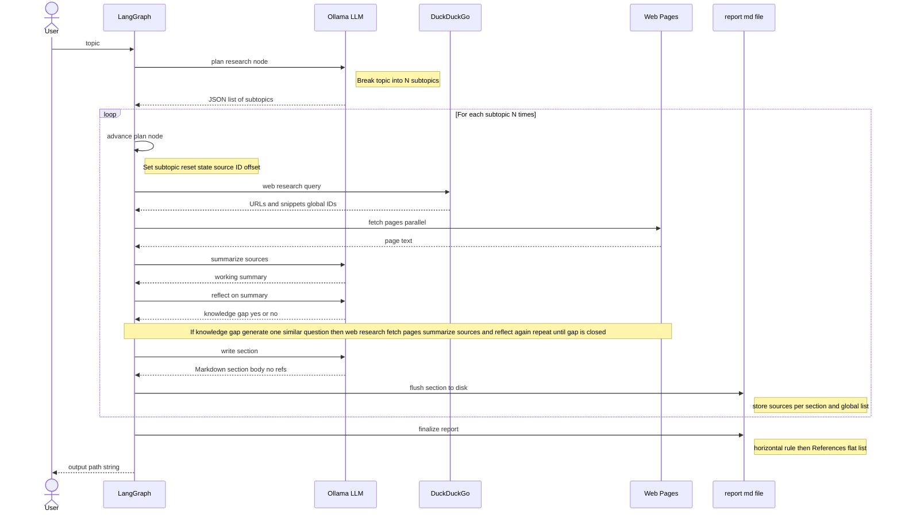

# DEEP RESEARCH

**Local deep research, in one command.** You give a topic; this CLI plans the work, searches the web, reads real pages, and turns what it finds into a **polished Markdown report** you can open anywhere. Everything runs on your machine: the brain is **Ollama**, the workflow is **LangGraph**, search comes from **DuckDuckGo** (`ddgs`), and articles are pulled in with **httpx** and **trafilatura**.

---

## Architecture

Under the hood it is simple to follow. First, your topic is split into **5–8 subtopics** (`plan_research`). For each one, the graph runs a web search; if the model still sees knowledge gaps, it asks **one** sharper follow-up query and searches again until it is satisfied. Each finished section is **written straight to disk** (`write_section`) before the next subtopic starts — so memory stays small on a laptop, and you still get a **long-form `.md` file** with citations at the end.



### LangGraph nodes and edges

The runnable graph is built in `src/deep_research/graph.py` on top of `SummaryState` in `src/deep_research/state.py`. Each **node** is a Python function that reads state and returns a patch dict; **edges** chain nodes, and **conditional edges** implement the research loop and the multi-subtopic loop.

| Node                         | Role                                                                                                                                                                                              |
| ---------------------------- | ------------------------------------------------------------------------------------------------------------------------------------------------------------------------------------------------- |
| `plan_research`              | Calls the LLM once to split the user topic into `research_plans` (subtopics), initializes file path and accumulators.                                                                             |
| `advance_plan`               | Sets the current subtopic (`topic`), resets per-plan fields (`sources`, `working_summary`, `need_more_research`, `loop_count`, …), and sets `source_id_offset` so citation IDs stay global.       |
| `web_research`               | Runs DuckDuckGo for `search_queries` if present, otherwise for the current subtopic string; merges hits into `sources` with relevance filtering.                                                  |
| `fetch_pages`                | Optionally fetches full HTML for up to `max_fetch_pages` URLs and attaches excerpt text to each source row.                                                                                       |
| `summarize_sources`          | LLM synthesizes a **working summary** from snippets and fetched excerpts for the current subtopic.                                                                                                |
| `reflect_on_summary`         | LLM returns JSON: whether there is a **knowledge gap** (`need_more_research`), a short reason (`reflection_text`), and an updated `loop_count` (capped by `--max-loops` / `max_loops` in config). |
| `generate_similar_questions` | When the router sends you here, the LLM fills `search_queries` for a sharper follow-up round (then `web_research` runs again).                                                                    |
| `write_section`              | LLM writes one Markdown section (no reference list); the node appends it to the report file, records `section_sources`, extends `all_sources`, and increments `current_plan_index`.               |
| `finalize_report`            | Appends a single grouped **References** block at the end of the file.                                                                                                                             |

---

## Usage

```bash
python -m deep_research "Your research question"
```

The report is written to `report_<topic>.md` in the current directory (derived from the topic string).

### Flags

| Flag                | Description                                                                                                                      |
| ------------------- | -------------------------------------------------------------------------------------------------------------------------------- |
| `--model`           | Ollama model name (overrides `OLLAMA_MODEL`)                                                                                     |
| `--max-loops`       | Reflection loop cap per subtopic (default 3)                                                                                     |
| `--max-results`     | DuckDuckGo results per query (default 5)                                                                                         |
| `--search-workers`  | Parallel DDG queries per round (default 4, max 16; `1` = sequential; or `DEEP_RESEARCH_SEARCH_WORKERS`)                          |
| `--lang`            | `ja` (default) or `en` — prompt and report language (or `DEEP_RESEARCH_LANG`)                                                    |
| `--max-plans`       | Number of subtopics to generate (5–8, default 6; or `DEEP_RESEARCH_MAX_PLANS`)                                                   |
| `--fetch-pages [N]` | Full-page fetches per round (default 8; or `DEEP_RESEARCH_FETCH_PAGES`). Pass `N` to override; `--fetch-pages` uses the default. |
| `--fetch-workers`   | Parallel HTTP fetches (default 4, max 16; `1` = sequential; or `DEEP_RESEARCH_FETCH_WORKERS`)                                    |
| `--no-fetch-pages`  | Disable full-page fetch (snippets only)                                                                                          |

---

## Output file structure

```markdown
# Research Topic

## Subtopic 1

(body text with inline citations [1][2]…)

## Subtopic 2

(body text with inline citations [3][4]…)

## References

1. Title A — URL
   _snippet_
2. Title B — URL
   _snippet_
3. Title C — URL
   …
```

- Each section body is **flushed to disk immediately** after its research loop completes.
- Source citation numbers (`[n]`) are **globally sequential** across all subtopics.
- References are appended in one block at the very end by `finalize_report`, so the file is readable even if the run is interrupted mid-way.

---

## Setup

### 1. Install Ollama and pull a model

[Install Ollama](https://ollama.com/), then pull a model (reasoning-oriented example):

```bash
ollama pull deepseek-r1:8b
```

### 2. Python environment (Python 3.11+)

```bash
cd /path/to/deep-research
python3 -m venv .venv
source .venv/bin/activate
pip install -e .
```

### 3. Optional `.env`

```env
OLLAMA_BASE_URL=http://127.0.0.1:11434
OLLAMA_MODEL=deepseek-r1:8b
DEEP_RESEARCH_MAX_LOOPS=3
DEEP_RESEARCH_MAX_RESULTS=5
DEEP_RESEARCH_LANG=en
DEEP_RESEARCH_MAX_PLANS=6
DEEP_RESEARCH_FETCH_PAGES=8
DEEP_RESEARCH_SEARCH_WORKERS=4
DEEP_RESEARCH_FETCH_WORKERS=4
```

---

## Troubleshooting

- **`Connection refused` (Ollama)**: run `ollama serve` and set `OLLAMA_BASE_URL` in `.env` if Ollama is not on the default host/port.
- **JSON parse errors**: try a smaller model (e.g. `llama3.2`) or lower `temperature` in `nodes.py`.
- **DuckDuckGo rate limits**: reduce `--max-results`, use `--search-workers 1`, or wait a moment.
- **Fetch errors / empty page text**: many sites block bots or require JavaScript — use `--no-fetch-pages`. For HTTP 429 floods try `--fetch-workers 1`.
