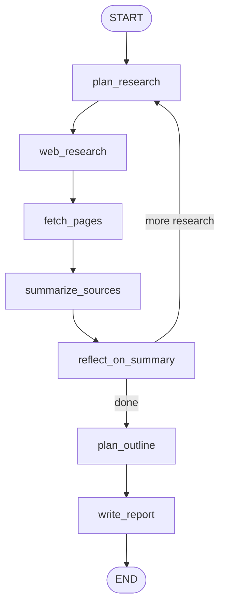
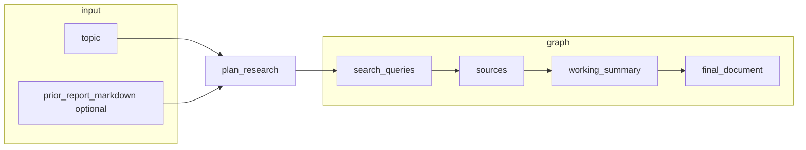
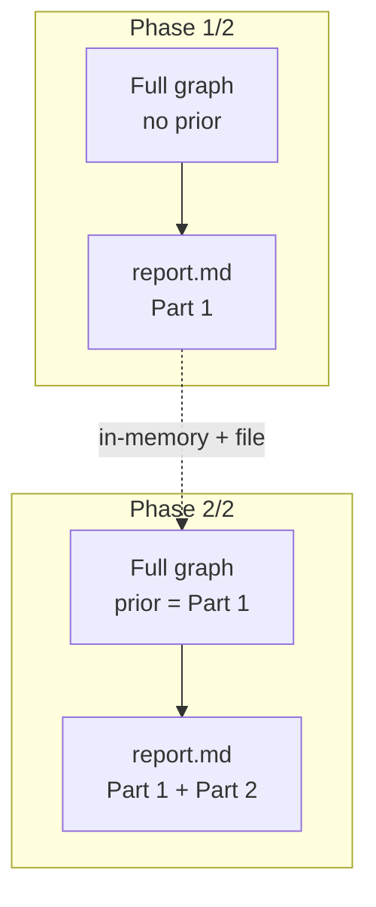

# Deep research flow

## Single CLI run (one phase)



## Input / state



## Two ways to get Part 1 + Part 2 in one file

### A) Two terminal commands

1. `deep-research "Q1" -o report.md`
2. `deep-research "Q2" -o report.md --prior-report report.md`

### B) One terminal command (`--follow-up`)

```bash
deep-research "First question" -o report.md --follow-up "Second question"
```



Repeat `--follow-up` for a third pass (each pass appends after the previous merged document).
