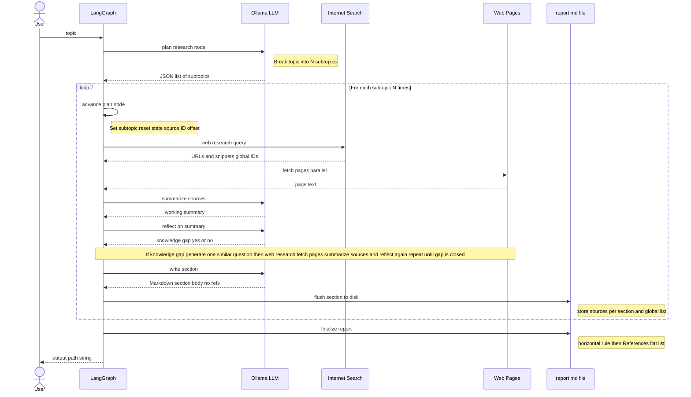

# Building a Local Deep Research Tool

## Overview

I built a deep research tool that runs completely locally using Ollama, LangGraph, and internet search. Given a research topic, it automatically breaks it down into subtopics, performs iterative web searches and page fetches, and generates a Markdown report with citations. Key features include no API keys required, privacy protection, and a lightweight design that runs on laptops.

This article covers the challenges I faced during implementation (JSON parsing errors, rate limiting, memory management, etc.) and their solutions, LangGraph state management design patterns, parallel processing optimization, and the possibilities and limitations of local LLMs.

**Tech Stack**: Python 3.11+, Ollama (deepseek-r1:8b), LangGraph, Web Search, trafilatura, httpx

**Source Code**: [GitHub Repository](https://github.com/jdd-jaba/deep_research)

---

## System Overview

First, the user question is split into **5-8 subtopics** (`create_subtopics`). For each subtopic, it runs web searches, and if the model reasons that more the current interenet sources are not enough and additional information is needed, it generates **one sharper follow-up query**, re-searches, and repeats until satisfied. As each subtopic section is completed, it **writes to disk immediately** (`write_section`) before moving to the next, so even on a laptop, you can manage context and end up with a **long `.md` file** with citations at the end.

### LangGraph Nodes and Edges

The execution graph is composed of nodes and edges. Each **node** is a function that reads the current state and returns only the updates as a dictionary. **Edges** connect nodes in series, and **conditional edges** implement "additional research loops" and "move to next subtopic loops."

| Node                                     | Role                                                                                                                                                                                                                    |
| ---------------------------------------- | ----------------------------------------------------------------------------------------------------------------------------------------------------------------------------------------------------------------------- |
| `create_subtopics`                       | Calls the LLM once to split the user's topic into `research_plans` (list of subtopics). Also initializes output file path and accumulation fields.                                                                      |
| `load_next_subtopic`                     | Sets the current subtopic as `topic` and resets plan-level fields (`sources`, `working_summary`, `need_more_research`, `loop_count`, etc.). Also sets `source_id_offset` so citation numbers are sequential across all. |
| `search_web`                             | Searches the internet with `search_queries` if available, otherwise with current subtopic string, merging hits into `sources` with relevance filtering.                                                                 |
| `fetch_page_content`                     | Fetches HTML up to max configured count, adding excerpt text to each source (optional processing).                                                                                                                      |
| `summarize_sources`                      | LLM creates a **working summary** (`working_summary`) from snippets and fetched excerpts for the current subtopic.                                                                                                      |
| `evaluate_coverage`                      | LLM returns JSON: **whether knowledge gap exists** (`need_more_research`), brief reason (`reflection_text`), updated `loop_count` (capped by `--max-loops` and config `max_loops`).                                     |
| `generate_similar_question_if_necessary` | When routed here, LLM fills in `search_queries` for follow-up, then proceeds back to `search_web`.                                                                                                                      |
| `write_section`                          | LLM writes section body Markdown only, node appends to report file. Updates `section_sources` and `all_sources`, advances `current_plan_index`.                                                                         |
| `finalize_report`                        | Appends the unified **References** block to the end of the file.                                                                                                                                                        |

---

## Building Process & Key Challenges

### From Prototype to Production

**Initial prototype** was simple: search the internet, pass results to LLM, print summary. But it had critical flaws - single search gave shallow information, memory overflowed with long topics, no structure, and unclear citations. This led to the core design: **split into subtopics → iterative research → incremental writing**.

### Three Major Implementation Decisions

**1. Incremental Writing Strategy**

Initially designed to write everything at once after all research, but this caused memory issues and lost everything on crashes. The solution: **append to file immediately as each subtopic completes**. Benefits:
- Memory stays constant (store only summaries, not full text)
- Progress survives crashes  
- Citation numbers stay sequential across all sections using offset calculation

**2. Parallel Processing Optimization**

Sequential processing was too slow. Parallelized both web search and page fetching with `asyncio`, using semaphores to limit concurrent workers. Through experiments, **worker count 4** proved optimal - faster than sequential, but avoids rate limits that higher counts trigger.

**3. Smart Loop Control**

Implemented a reflection loop where LLM judges if more research is needed. Challenge: LLMs are too curious (always want more) or too lenient (accept shallow info). Solution: `max_loops` parameter capping iterations. **Default 3 loops** balances quality and speed: initial search → additional dive 1 → additional dive 2 → write.

**4. LLM Output Quality**
- JSON parsing errors from broken output (trailing commas, code blocks)
- Solution: Regex extraction function that cleans and fixes JSON before parsing (90%+ success)
- Prompt engineering crucial: state role explicitly, provide specific numbers, show format examples
- Temperature tuning per task (0.7 for creative, 0.1 for strict judgment)

**5. Web Scraping Pitfalls**
- Bot detection blocking requests
- Solution: Set realistic browser headers (User-Agent, Accept)
- Rate limiting from search engines and websites
- Solution: Exponential backoff retry, limit workers to 4-8, set timeouts
- Text extraction failures on JavaScript sites or image-heavy pages
- Solution: Skip pages with no/short content, truncate huge pages, use snippet-only mode

**6. Knowledge Gap Judgment**
- LLMs either too eager to research more or too accepting of shallow info
- Solution: Explicit evaluation prompts with clear criteria, max_loops cap to prevent infinite loops
- Experiments showed 3 iterations optimal for quality/speed balance

**7. LangGraph State Management**
- Use differential updates: Set `total=False` to return only changed fields, not entire state
- Create state reset nodes to clear per-subtopic data between iterations
- Separate global state (all_sources) from local state (current sources)
- Keep nodes simple, extract complex branching to conditional edges for easier testing
- Debug with print statements, Mermaid diagrams, and recursion_limit for step execution

**8. Local LLM Integration (Ollama)**
- Zero cost and privacy-focused, but slower without GPU
- `deepseek-r1:8b` proved best balance of quality and speed
- Don't run LLM and parallel fetch simultaneously (memory issues)
- Configure parallelism via OLLAMA_NUM_PARALLEL and OLLAMA_NUM_GPU environment variables

**9. Web Research Automation**
- Generate follow-up queries by explicitly stating what's missing, specifying timeframes
- Filter search results with keyword matching (50%+ overlap threshold)
- Manage citations with global IDs, per-section tracking, and final consolidation
- Use exponential backoff for rate limits, realistic headers for bot protection

---

## Actual Performance and Results

### Test Results

#### Sample Theme Execution Example

**Theme**: "Impact of Amazon's AWS and AI Strategy on 2026 Enterprise Value"

**Execution**: Run with deepseek-r1:8b model, max-loops set to 3, and English language mode.

**Results**:

- **Subtopic count**: 6
- **Total sections**: 6 sections
- **Total citations**: 47
- **Output file size**: ~15KB (Markdown)
- **Final report lines**: ~400 lines

#### Processing Time Breakdown

| Phase                    | Time       | Percentage |
| ------------------------ | ---------- | ---------- |
| Subtopic generation      | 5s         | 2%         |
| Web search (total)       | 30s        | 12%        |
| Page fetch (total)       | 90s        | 35%        |
| Summarization (total)    | 60s        | 23%        |
| Knowledge gap evaluation | 30s        | 12%        |
| Section writing          | 40s        | 15%        |
| Citation list creation   | 3s         | 1%         |
| **Total**                | **~4 min** | **100%**   |

**Environment**: MacBook Pro 14-inch (Nov 2024), Apple M4 Pro, 48GB RAM, macOS Sequoia 15.3.1

#### Generated Report Quality

Checking the actual generated `report_*.md`:

- **Structure**: Clear headings, easy to read
- **Content**: Each section is specific, includes numerical data
- **Citations**: Properly numbered, list at end
- **Duplication**: Almost none (occasionally similar phrasing)

**Room for improvement**:

- No images or diagrams (text only)
- Sometimes multiple citations from same source
- Japanese naturalness varies by model

#### Resource Usage

**Test Environment**: MacBook Pro 14-inch (Nov 2024), Apple M4 Pro, 48GB RAM, macOS Sequoia 15.3.1

**Memory Usage**:
- Peak: ~2.5GB (including Ollama)
- Average: ~1.8GB
- Breakdown: Ollama process (1.2GB), Python process (600MB)
- Thanks to incremental writing, memory usage stays nearly constant even for long themes

**CPU Load**:
- During LLM inference: 200-400% (4 cores full power)
- During web search/fetch: 50-100% (parallel I/O)
- Idle: <5%
- Works on M1 Mac efficiency cores too, but inference is slower

**Network Load**:
- Total download: ~5-10MB (depends on theme)
- Request count: 50-100
- Bandwidth: Peak ~1Mbps
- Works fine over Wi-Fi
